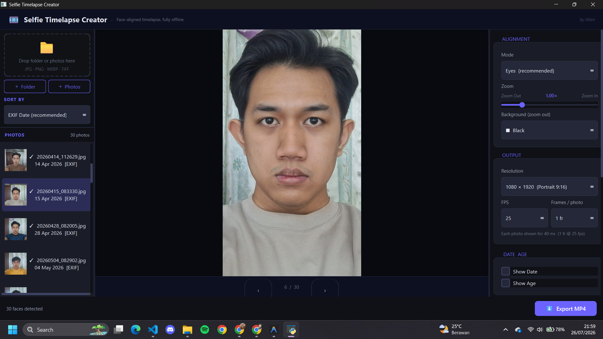
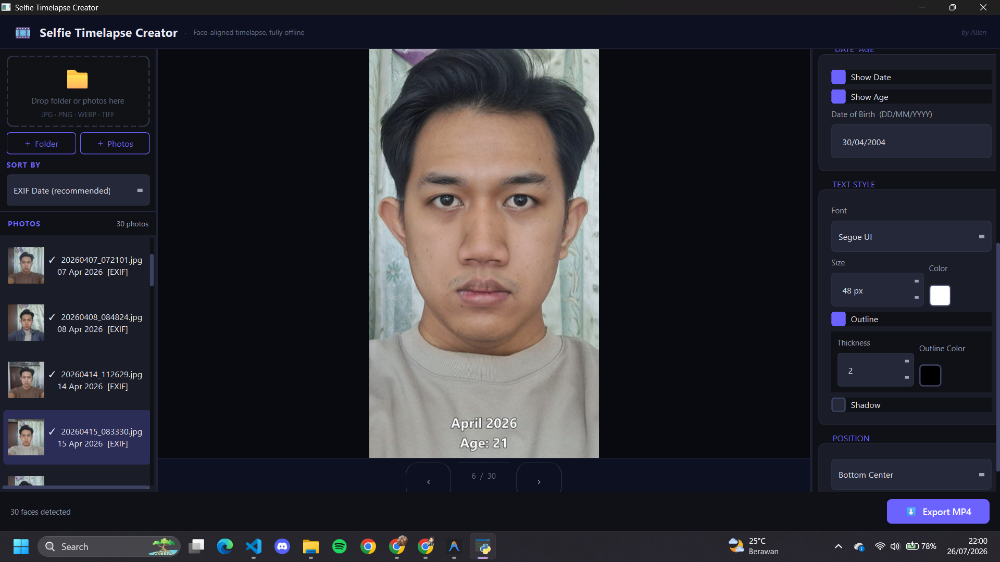

# Selfie Timelapse Creator

Selfie Timelapse Creator is a fully offline, privacy-first desktop application built with Python and PySide6 that automatically aligns and renders selfie timelapse videos. It eliminates the manual drudgery of lining up faces in video editing software by leveraging robust face detection and an efficient FFmpeg pipeline.

## Screenshots

| Face Alignment & Zoom | Date & Age Overlay |
|:---:|:---:|
|  |  |

## Features

- **Automated Face Alignment**: Automatically detects faces and aligns photos based on either eyes or facial bounding boxes.
- **Offline First**: All image processing and face detection (powered by MediaPipe) happen locally on your machine.
- **Custom Overlays**: Add custom text, dates, or dynamically calculated ages on top of your timelapse video. Customize colors, fonts, shadows, and placement.
- **Fast Export Pipeline**: Exports raw video directly through FFmpeg pipes without intermediate disk writes, ensuring optimal speed.
- **Dark Theme Interface**: A sleek, modern user interface built using PySide6.

## Architecture & Code Organization

The source code is structured as follows:

```
src/
├── main.py                     # Entry point for the application
├── ui/                         # PySide6 UI panels, widgets, and styles
│   ├── styles/                 # QSS theme styling
│   ├── panels/                 # App interface sections (Import, Settings, Preview, etc.)
│   └── widgets/                # Reusable and specialized UI controls
├── core/                       # Core logic and background worker threads
│   ├── photo_importer.py       # Exif extraction & thumbnail generator (QThread)
│   ├── face_detector.py        # MediaPipe wrapper & detection thread
│   ├── face_aligner.py         # Image alignment manager
│   ├── preview_worker.py       # Debounced preview generator
│   └── video_renderer.py       # FFmpeg pipe export worker
├── models/                     # Data structures (Dataclasses)
│   ├── project_settings.py     # Single source of truth for global configurations
│   ├── photo_item.py           # Represents a single photo with metadata
│   └── face_landmarks.py       # Abstraction for facial landmarks
├── renderers/                  # Drawing utilities
│   └── overlay_renderer.py     # QPainterPath-based text overlays
├── strategies/                 # Algorithms
│   └── alignment_strategy.py   # Implementations for eye vs bounding box alignment
├── utils/                      # Helper scripts (path resolution, calculations)
└── assets/                     # MediaPipe models and bundled dependencies
```

## Requirements

Ensure you have Python 3.11+ installed. Install the dependencies listed in `requirements.txt`:

```bash
pip install -r requirements.txt
```

> [!IMPORTANT]
> To use the application, you must download the MediaPipe `face_landmarker.task` file into `src/assets/models/`. You also need to have `ffmpeg` accessible on your system PATH or bundled in `src/assets/ffmpeg/`.

## Running the Application

To launch the application from source:

```bash
python src/main.py
```

## Building

A PyInstaller configuration file (`build.spec`) is included to compile the application into a standalone Windows executable. Make sure you install PyInstaller:

```bash
pip install pyinstaller
```

Run the build script:

```bash
pyinstaller build.spec
```

The compiled application will be located in the `dist/` directory.

## Download

Don't want to build from source? Scan the QR code below to download the latest pre-built Windows executable directly.

<div align="center">
  
  <br/>
  <sub>Scan to download <strong>Selfie Timelapse Creator.exe</strong></sub>
</div>